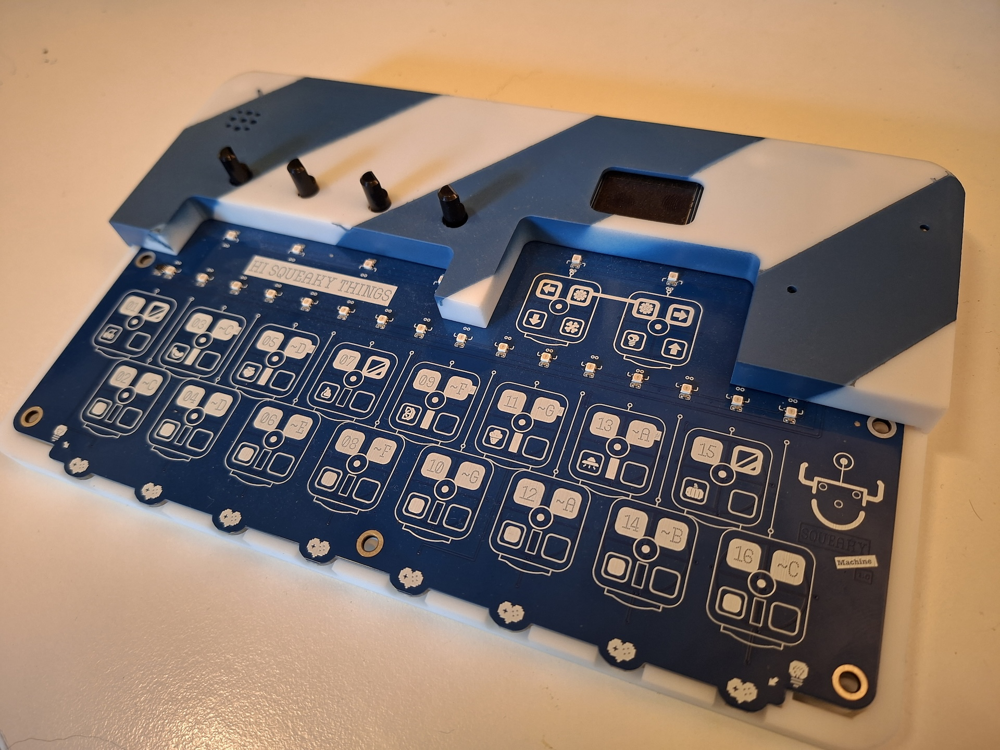

## Hi Squeaky Things Lab

> [!WARNING]
> **Hi Squeaky Things** can happen at any time. Our _Little Squeaky Things_ products are ready to squeak, squuuueak, squeeeeeaak, squeaaaaaaaaak!

We are an alternative instruments open research lab based in The Netherlands. 
What we do:

### 💡 Research

We are researching new ways to create musical instruments to redefine the future of music.

```
 ⡇ ⡇⢹⠁⢹⠁⡇ ⣏⡉ ⡇⢸⣏⡉⡇⣏⡱⡏⢱⡎⢱
 ⠧⠤⠇⠸ ⠸ ⠧⠤⠧⠤ ⠟⠻⠧⠤⠇⠇⠱⠧⠜⠣⠜
```

- [Little Weirdo](https://github.com/hi-squeaky-things/little-weirdo), a Rust #no-std optimized wave table synthesizer for embedded devices.

🎹 Listen to the Ebass patch (unmute the audio 🔇 ➡️ 🔊) :

https://github.com/user-attachments/assets/7ee9a29f-a4da-421e-a9d5-a7aa040de527

### 🎛️ Products

Our products are open-source software & hardware pieces designed to revolutionize your music creation experience.

```
 ⡇ ⡇⢹⠁⢹⠁⡇ ⣏⡉ ⢎⡑⡎⢱⡇⢸⣏⡉⣎⣱⣇⠜⢇⢸ ⡷⢾⣎⣱⡎⠑⣇⣸⡇⡷⣸⣏⡉
 ⠧⠤⠇⠸ ⠸ ⠧⠤⠧⠤ ⠢⠜⠣⠪⠣⠜⠧⠤⠇⠸⠇⠱ ⠇ ⠇⠸⠇⠸⠣⠔⠇⠸⠇⠇⠹⠧⠤
```

- [Little Squeaky Machine](https://github.com/hi-squeaky-things/little-squeaky-machine-hardware), a hardware reference platform for [Little Weirdo](https://github.com/hi-squeaky-things/little-weirdo).




### 🔈 Music

We craft original music by blending our custom-built open software, unique open hardware instruments, and cutting-edge research.
